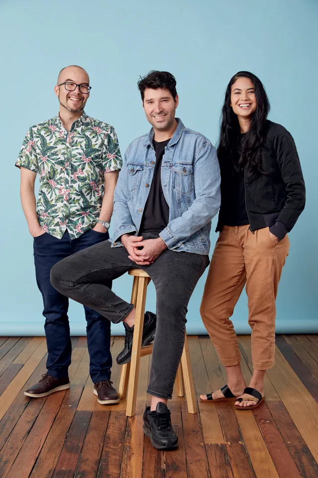

---
# Founding Team Of Canva

* Melanie Perkins 
* Cliff Obrecht 
* Cameron Adams

---

# Background Info 
* Was founded on June 28, 2012 
* Launched im August, 2013
* 60 million + users 
* 190 countries 
* 100 languages 

---
# Benifits Of Using Canva
* User Friendly Design Tool 
* Wide Range Of Templates 
* Buget Friendly Options 
* 100 Million Plus Stock Files 
* Powerful Design Feature 
* Multiple Graphic Options 
* Schedlue Social Media Post 

--- 
# Canva Free vs Paid 

Free Canva lets you comment, share links, assign tasks, access to limited grpahic and template options. 

Paid Canva lets you do all of this plus have team-only links, team report, access to all graphic and templates options. 

---
# Why I Like Canva 

* Super Easy To Use 
* Tons Of Options With The Free Version 
* Good Template Options 
